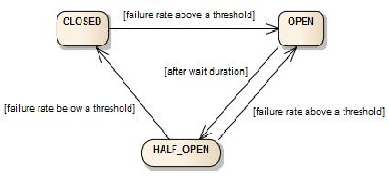

## Tag s1.cb.1.CircuitBreaker
Resilience4j as circuit breaker for OpenFeign client

### Reliability
A microservice application with an uptime percentage of 99.9% can be considered high available, but a downtime of 0.1% quickly becomes pronounced as volumes increases.
Per 1000 requests, there might be only one failure, but per million requests, it's 1000 failures. So high available service is not enough, we need high reliable system.

Reliability quantifies the likelihood of service/equipment to operate as intended without disruptions or downtime. It focuses on:
* Probability of success for a period of time
* Dependability of an asset to continuously be operational without failures

Reliability can be measured using the Mean Time Between Failure(MTBF), also known as failure rate
* MTBF = Operating time (hours) /Number of failure
* Failure rate = Number of failures/Unit of time

* Example:
  * MTBF - 2000 hours: only 1 failure within 2000hours 
  * Failure Rate - 0.0005 per hour, 0.0005 failure within one hour

High available design focuses on how to make the system alive, while high reliable design focuses on how to deal with failures.
In a complex system, it's inevitable that failures will occur. The source of failure may be hardware failures, communication breakage(network,firewall,dns), dependencies failure(database,third party api), internal issue(bugs) and so on.
Don't try to design a non-failure system, just make the system fault tolerance. 

Fault tolerance is the property that enables a system to continue operating properly in the event of the failure of one or more faults within some of its components. 

| Strategy           | Premise                                                                                                                                                                                                                                                                                          | Aka                                                        | How does it mitigate                                                                                           |
|--------------------|--------------------------------------------------------------------------------------------------------------------------------------------------------------------------------------------------------------------------------------------------------------------------------------------------|------------------------------------------------------------|----------------------------------------------------------------------------------------------------------------|
| Retry              | Many faults are transient and may self-correct after a short delay.                                                                                                                                                                                                                              | "Maybe it's just a blip"                                   | Allows configuring automatic retries.                                                                          |
| Circuit Breaker    | When a system is seriously struggling, failing fast is better than making users/callers wait. <br/> Protecting a faulting system from overload can help it recover.                                                                                                                              | "Stop doing it if it hurts"<br/>"Give that system a break" | Breaks the circuit (blocks executions) for a period, when faults exceed some pre-configured threshold.         |
| Timeout            | Beyond a certain wait, a success result is unlikely.                                                                                                                                                                                                                                             | "Don't wait forever"                                       | Guarantees the caller won't have to wait beyond the timeout.                                                   |
| Bulkhead Isolation | When a process faults, multiple failing calls can stack up (if unbounded) and can easily swamp resource (threads/ CPU/ memory) in a host.<br/> This can affect performance more widely by starving other operations of resource, bringing down the host, or causing cascading failures upstream. | "One fault shouldn't sink the whole ship"                  | Constrains the governed actions to a fixed-size resource pool, isolating their potential to affect others.     |
| Rate limiting      | Limiting the rate a system handles requests is another way to control load.<br/>This can apply to the way your system accepts incoming calls, and/or to the way you call downstream services.                                                                                                    | "Slow down a bit, will you?"                               | Constrains executions to not exceed a certain rate.                                                            |
| Fallback           | Things will still fail - plan what you will do when that happens.                                                                                                                                                                                                                                | "Degrade gracefully"                                       | Defines an alternative value to be returned (or action to be executed) on failure.                             |
| Cache              | Some proportion of requests may be similar.                                                                                                                                                                                                                                                      | "You've asked that one before                              | Provides a response from cache if known. <br/> Stores responses automatically in cache, when first retrieved.  |

Table is based on [Polly](https://github.com/App-vNext/Polly#resilience-policies).

### Spring Cloud Circuit Breaker
There are some fault tolerance OSS:
* Netflix Hystrix
  * https://github.com/Netflix/Hystrix
  * in maintenance mode(1.5.18, since2018)
* Resilience4j
  * https://github.com/resilience4j/resilience4j
  * inspired by Hystrix, successor of it
* Alibaba Sentinel
  * https://github.com/alibaba/Sentinel

[Spring Cloud Circuit Breaker](https://docs.spring.io/spring-cloud-circuitbreaker/docs/current/reference/html/) provides an abstraction across different circuit breaker implementations.
It contains implementations for Resilience4J and Spring Retry. The APIs implemented in Spring Cloud CircuitBreaker live in Spring Cloud Commons.
For example, we used Resilience4j in this tag, the corresponding starter needs to be added.
```xml
  <dependency>
      <groupId>org.springframework.cloud</groupId>
      <artifactId>spring-cloud-starter-circuitbreaker-resilience4j</artifactId>
  </dependency>
```
Then the modules of Resilience4j such as CircuitBreaker and TimeLimiter can be configured in Spring application.yml.
```ymal
resilience4j.circuitbreaker:
  configs:
    default:
      registerHealthIndicator: true
      slidingWindowSize: 100
      permittedNumberOfCallsInHalfOpenState: 10
      slidingWindowType: TIME_BASED
  instances:
    obo-cinema:
      registerHealthIndicator: true
      slidingWindowSize: 10
      permittedNumberOfCallsInHalfOpenState: 3
      slidingWindowType: COUNT_BASED
      failureRateThreshold: 50
      slowCallRateThreshold: 50
      slowCallDurationThreshold: 100
      waitDurationInOpenState: 20s
      automaticTransitionFromOpenToHalfOpenEnabled: false
```
The 'instances' element listed all circuit breaker instances. 'obo-cinema' is the name of one instance.
The name then can be used to configure annotations in the source code, like @CircuitBreaker(name = "obo-cinema").

The Resilience4j CircuitBreaker is implemented via a finite state machine with three normal states: CLOSED, OPEN and HALF_OPEN and two special states DISABLED and FORCED_OPEN.



It uses a sliding window to store and aggregate the outcome of calls. You can choose between a count-based sliding window and a time-based sliding window.
In our configuration, the default sliding window type is time based, and the size is 100. For 'obo-cinema' instance, the type is count based, size is 10.
According to this configuration, the circuit breaker will be opened when 50% calls are failed or slow. And it will become half-open if there's no calls within 20 seconds.
In half-open state, only 3 call will be allowed until there's no error.

See [here](https://docs.spring.io/spring-cloud-circuitbreaker/docs/current/reference/html/#circuit-breaker-properties-configuration) for more examples.