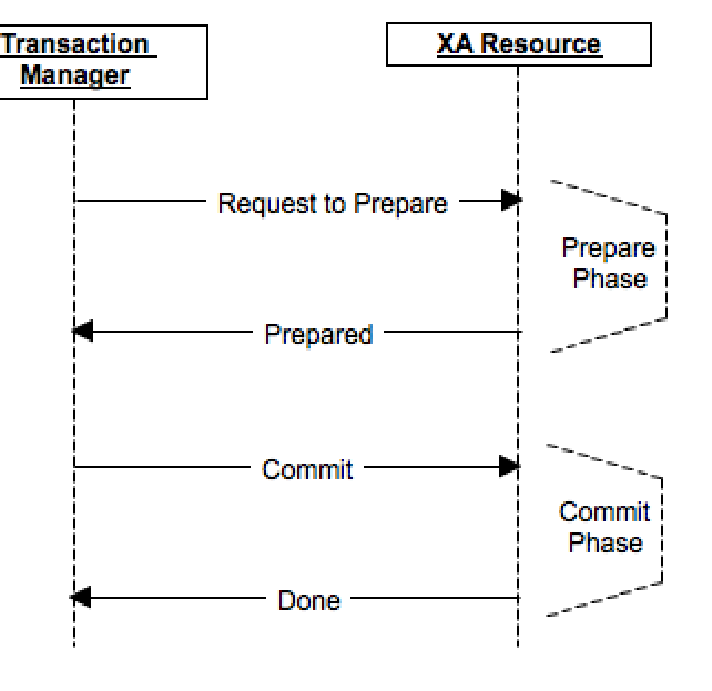
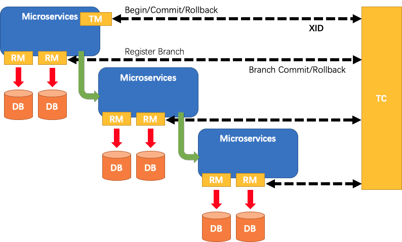

## Tag s2.db.1.SEATA.AT
Use SEATA as distributed transaction solution

### ACID vs. BASE
Database transaction in microservices is quite different with the traditional transaction.
#### ACID
ACID is a set of properties of database transactions intended to guarantee data validity despite errors, power failures, and other mishaps.
* Atomicity
  * Each transaction is treated as a single operation
  * Either succeeds completely or fails completely (All Occurs or Nothing Occurs)
* Consistency
  * Each transaction must change data in allowed ways (constraints, cascade, rules)
  * From one valid state to another
* Isolation
  * Concurrent transactions leave database in state as if they are executed sequentially
  * An incomplete transaction may not be visible to other transactions
* Durability
  * Committed transaction will be permanent even in the case of system failure

Each microservice has its own database, so the transaction between different services are typically distributed transaction.
In order to achieve ACID in distributed transaction, X/Open issued XA(short for "eXtended Architecture") specification in 1991. 



XA needs to lock XA resources during the transaction, it's too expensive for model business transaction. 
But its basic ideology inspired modern distributed transaction theory.

#### CAP
CAP is an abbreviation of:
* Consistency: every read receives the most recent write or an error
* Availability: every request receives a (non-error) response, without the guarantee that it contains the most recent write
* Partition Tolerance: the system continues to operate despite an arbitrary number of messages being dropped (or delayed) by the network between nodes.

Eric Brewer(professor emeritus of computer science at University of California, Berkeley) stated that any distributed data store can only provide two of the three guarantees.
And this is known as CAP theorem for distributed network applications. The following picture shows some data storage CAP category:


For distributed system, partition tolerance is a mandatory property. We have to compromise either consistency or availability.

#### BASE
BASE is an abbreviation of:
* BAsically available
  * reading and writing operations are available as much as possible
  * but might not be consistent
* Soft-state
  * In a period of time, state is inconsistent
* Eventual Consistent

BASE is also well-known as Eventual Consistency. 
Eventual consistency is a consistency model used in distributed computing to achieve high availability that informally guarantees that, if no new updates are made to a given data item, eventually all accesses to that item will return the last updated value.
So you can see that BASE is based on CAP theorem, it compromises consistency to ensure high availability. 
But it doesn't abandon consistency, it uses eventual consistency.

### SEATA
[SEATA](https://seata.io)(Simple Extensible Autonomous Transaction Architecture) is an open source distributed transaction solution dedicated to providing high performance and easy to use distributed transaction services. 
It supports both ACID and eventual consistency, see the [following paragraph](#mode) for more information about SEATA modes. 
The following picture shows an example architecture:



SEATA contains three components:
* TC - Transaction Coordinator
  * Maintain status of global and branch transactions, drive the global commit or rollback.
* TM - Transaction Manager
  * Define the scope of **_global transaction_**: begin a global transaction, commit or rollback a global transaction.
* RM - Resource Manager
  * Manage resources that **_branch transactions_** working on, talk to TC for registering branch transactions and reporting status of branch transactions, and drive the branch transaction commit or rollback.

#### SEATA server
As shown in the picture, no matter what kind of mode is used, transaction coordinator is required to maintain status of global and branch transactions and drive the global commit or rollback.
SEATA developed an independent middle ware to achieve that, it's run as a web service. It's called SEATA server. 
You can [download](https://seata.io/en-us/blog/download.html) a binary file and run it directly.
You can also run it in a Spring Boot application, just like what we do in [obo-seata](../obo-seata).

Be aware, SEATA must be deployed as a cluster in the production environment. It's a crucial middle ware in the whole system.
Because without it, no transaction can be run successfully, SEATA server must be alive before you execute any global transaction.
Basically global HA config center, HA database and HA registry are required to set up an HA SEATA cluster.  
See [here](https://seata.io/en-us/docs/ops/deploy-ha.html) for more information about HA SEATA.

#### SEATA client
SEATA client is integrated with the services. It communicates with SEATA server, and commits/rollbacks local/branch transactions according to the coordination of SEATA server.

The library of SEATA client is included in [Spring Cloud Alibaba](https://spring.io/projects/spring-cloud-alibaba#learn), so the best way to involve SEATA is adding Spring Cloud Alibaba.
The following table shows the version dependency between Spring Cloud Alibaba and Spring Cloud, Spring Boot.

| Spring Cloud Alibaba | Spring Cloud | Spring Boot | Seata |
|----------------------|--------------|-------------|-------|
| 2021.0.1.0           | 2021.0.x     | 2.6.x       | 1.4.2 |
| 2.2.7.RELEASE        | Hoxton.SRx   | 2.3.x       | 1.3.0 |


According to the above table, we have to downgrade the version of Spring Cloud and Spring Boot. And the following dependencies should be added:

```xml
        <dependency>
            <groupId>com.alibaba.cloud</groupId>
            <artifactId>spring-cloud-alibaba-commons</artifactId>
        </dependency>
        <dependency>
            <groupId>com.alibaba.cloud</groupId>
            <artifactId>spring-cloud-starter-alibaba-seata</artifactId>
        </dependency>
```
Seata client don't need to be the same version with Seata server.

#### Durid for Datasource
SEATA must generate a proxy of the datasource, that can give SEATA opportunities to parse SQL statement and generate undo SQL for the transaction.
But only when Druid is used as datasource, the proxy can be generated automatically. For other datasource type, the proxy needs to inject to spring container manually.
The proxy datasource is io.seata.rm.datasource.DataSourceProxy. To enable Druid, add the following dependency:
```xml
<dependency>
    <groupId>com.alibaba</groupId>
    <artifactId>druid-spring-boot-starter</artifactId>
</dependency>
```

#### @GlobalTransaction
The method which requires a distributed transaction should be annotated by @GlobalTransaction.
SEATA will generate a global xid for each transaction. You can use `RootContext.getXID()` to get xid.
If two branch transactions have a same xid, they belong to a same global transaction.

#### Kyro for Serialization

Seata 1.4.2 will throw exception while updating 'datatime' column.
The reason is that SEATA uses Jackson framework to parse datetime data, but Jackson doesn't have appropriate parser for 'datetime'.
The configuration 'seata.client.undo.log-serialization=kryo' makes SEATA use Kryo to parse.
[Kryo](https://github.com/EsotericSoftware/kryo) is a fast and efficient binary object graph serialization framework for Java.
[kryo-serializers](https://github.com/magro/kryo-serializers) provides kryo (v2, v3, v4) serializers for some jdk types and some external libs like e.g. joda time.
So we need add kryo-serializers to enrich Kryo's serializers:
```xml
<dependency>
    <groupId>de.javakaffee</groupId>
    <artifactId>kryo-serializers</artifactId>
</dependency>
```

### Configuration
The following configuration should be added to [application.yml](../obo-trade/src/main/resources/application.yml):
```yaml
spring:
  cloud:
    alibaba.seata:
      tx-service-group: trade-service

seata:
  enabled: true
  enable-auto-data-source-proxy: true
  data-source-proxy-mode: AT
  service:
    vgroup-mapping:
      trade-service: default
    grouplist:
      default: 127.0.0.1:8091
    disable-global-transaction: false
  client:
    undo:
      log-serialization: kryo
```
In the above configuration, we configure SEATA in application.yml file directly. But in the production environment, we should use configuration middle ware.
SEATA supports the following component as configuration center:
* Nacos
* Consul
* Apollo
* Etcd
* Zookeeper
* File (default is 'file.conf' in the root of classpath)

[Here](https://github.com/alibaba/spring-cloud-alibaba/blob/2021.x/spring-cloud-alibaba-examples/seata-example/business-service/src/main/resources/application.yml) is an example to use Nacos as configuration center.

The most complex concept in the configuration of SEATA is service group.
Service group is a virtual group in SEATA. It is used to map a group of service to a specific SEATA cluster, so that an incident of the SEATA cluster only impacts that group of services.
In our example, we define obo-trade as a member of trade-service, i.e. `spring.cloud.alibaba.seata.tx-service-group=trade-service`.
And then this group is mapped to 'default' SEATA cluster, i.e. `seata.service.vgroup-mapping.trade-service=default`.
And 'default' is defined as `seata.service.grouplist.default=127.0.0.1:8091`. 
So finally obo-trade will communicate with the TC exposed on '127.0.0.1:8091'.

In brief, the design of virtual group can improve the availability of SEATA. You can easily switch a crashed SEATA cluster to another one if you have free cluster. 

### Mode
Seata supports AT, TCC, SAGA, and XA transaction modes to create a one-stop distributed solution for users.
#### AT
AT(Automatic Transaction) is the main mode in SEATA, it's an evolution from the two phases commit protocol:
* Phase 1：commit business data and rollback log in the same local transaction, then release local lock and connection resources.
* Phase 2：
  * for commit case, do the work asynchronously and quickly.
  * for rollback case, do compensation, base on the rollback log created in the phase 1.

In order to save rollback sql, AT mode requires create a local table 'undo_log':
```roomsql
CREATE TABLE `undo_log` (
  `id` bigint(20) NOT NULL AUTO_INCREMENT,
  `branch_id` bigint(20) NOT NULL,
  `xid` varchar(100) NOT NULL,
  `context` varchar(128) NOT NULL,
  `rollback_info` longblob NOT NULL,
  `log_status` int(11) NOT NULL,
  `log_created` datetime NOT NULL,
  `log_modified` datetime NOT NULL,
  `ext` varchar(100) DEFAULT NULL,
  PRIMARY KEY (`id`),
  UNIQUE KEY `ux_undo_log` (`xid`,`branch_id`)
) ENGINE=InnoDB AUTO_INCREMENT=1 DEFAULT CHARSET=utf8;
```
When the transaction executes, SEATA will parse SQL statement to generate rollback SQL. Now it can support the following databases:
* MySQL
* Oracle
* PostgreSQL
* TiDB
* MariaDB

So in this tag, we have to replace H2 database with [MySQL](mysql.md).

#### TCC
TCC(Try-Confirm/Cancel) mode is something like AT mode, but you need to commit/rollback local transaction in a predefined callback method.
So in TCC, you should define three method in an interface for transaction preparation,commit and rollback, like:
```java
public interface TccActionOne {

  @TwoPhaseBusinessAction(name = "TccActionOne", commitMethod = "commit", rollbackMethod = "rollback")
  public boolean prepare(BusinessActionContext actionContext, int a);

  public boolean commit(BusinessActionContext actionContext);

  public boolean rollback(BusinessActionContext actionContext);
}
```
@TwoPhaseBusinessAction declares the commit/rollback method. So when it is invoked, the framework knows which method should be executed while it's successful/failed.
The user must provide the implementation of it. See [here](https://github.com/seata/seata-samples/tree/master/tcc/springboot-tcc-sample) for more examples.

#### Saga
[Saga](extension://oikmahiipjniocckomdccmplodldodja/pdf-viewer/web/viewer.html?file=https%3A%2F%2Fwww.cs.cornell.edu%2Fandru%2Fcs711%2F2002fa%2Freading%2Fsagas.pdf) is another compensating distributed transaction pattern.
A saga is a sequence of local transactions. 
Each local transaction updates the database and publishes a message or event to trigger the next local transaction in the saga.
If a local transaction fails because it violates a business rule then the saga executes a series of compensating transactions that undo the preceding local transactions changes.
Saga is suitable in the following situation:
* Long business processes, many business processes
* Participants include other company or legacy system services and cannot provide the three interfaces required by the TCC model

Currently, the Saga mode provided by SEATA is implemented based on the state machine engine. The mechanism is:
1. Define the process of service invocation through state diagram and generate json state language definition file. 
2. A node in the state diagram can call a service, and the node can configure its compensation node. 
3. The state diagram json is driven by the state machine engine. When an exception occurs, the state engine reversely executes the compensation node corresponding to the successful node and rolls back the transaction. 
4. Support the realization of service orchestration requirements, support single selection, concurrency, sub-process, parameter conversion, parameter mapping, service execution status judgment, exception capture and other functions. 

See an example of [state definition](https://github.com/seata/seata-samples/blob/master/saga/local-saga-sample/src/main/resources/statelang/reduce_inventory_and_balance.json).